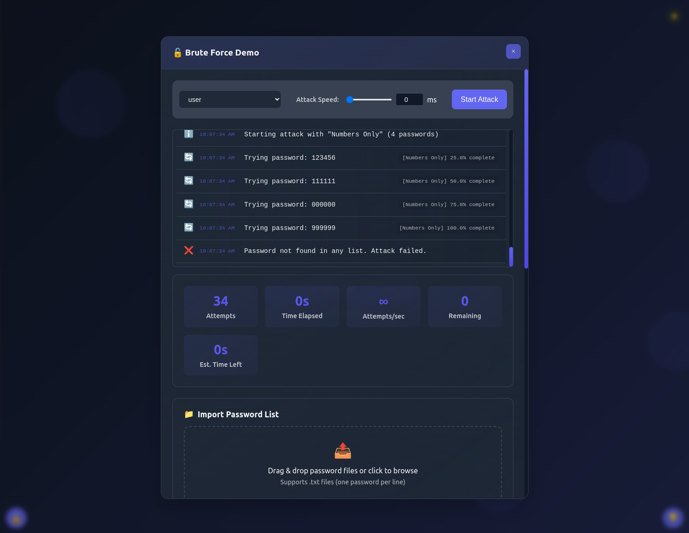

<h1 align="center">Brute Force Example</h1>

<p align="center">
  
  
  
  
  
  
</p>

<hr>

<p align="center">
  <a href="#dart-about">About</a> &#xa0; | &#xa0; 
  <a href="#sparkles-features">Features</a> &#xa0; | &#xa0;
  <a href="#dash-getting-started">Getting Started</a> &#xa0; | &#xa0;
  <a href="#raised_hands-contributing">Contributing</a> &#xa0; | &#xa0;
  <a href="#memo-license">License</a> &#xa0; | &#xa0;
  <a href="https://jotrorox.com" target="_blank">Author</a>
</p>

<p align="center">
  
</p>

## :dart: About ##

This is a simple educational Website made to showcase how dangerous Brute Force Attacks can be. And also how strong passwords can be used to prevent them. It's made with HTML, CSS and JavaScript and fully contained within a single HTML file.\

**Please use this responsibly and I do not take any responsibility for any damage caused by this or by the knowledge gained from this.**

## :sparkles: Features ##

:heavy_check_mark: Login & Registration\
:heavy_check_mark: User & Password persistance\
:heavy_check_mark: Brute Force Attack Simulation


## :dash: Getting Started ##

It's pretty simple either you use the hosted version on GitHub Pages or you can download the code and run it locally.

**The hosted Version is available at [https://jotrorox.github.io/bruteForceExample/](https://jotrorox.github.io/bruteForceExample/)**

Or clone the repo and host the file using the webserver of your choice, or just open the file in your browser.

```bash
git clone https://github.com/Jotrorox/bruteForceExample.git
```

**You can do that over matrix: @jotrorox:matrix.org, Email: [mail@jotrorox.com](mailto:mail@jotrorox.com) or Discord: https://discord.gg/RVr4cceFUt**

## :raised_hands: Contributing ##

Contributions are what make the open source community such an amazing place to learn, inspire, and create. Any contributions you make are **greatly appreciated**.

If you have a suggestion that would make this better, please fork the repo and create a pull request. You can also simply open an issue with the tag "enhancement".
Don't forget to give the project a star! Thanks again!

1. Fork the Project
2. Create your Feature Branch (`git checkout -b feature/AmazingFeature`)
3. Commit your Changes (`git commit -m 'Add some AmazingFeature'`)
4. Push to the Branch (`git push origin feature/AmazingFeature`)
5. Open a Pull Request


## :memo: License ##

This project is under the MIT License. For more details, see the [LICENSE](LICENSE) file.

<br>

Made with :heart: by <a href="https://jotrorox.com" target="_blank">Jotrorox</a>

&#xa0;

<a href="#top">Back to top</a>
